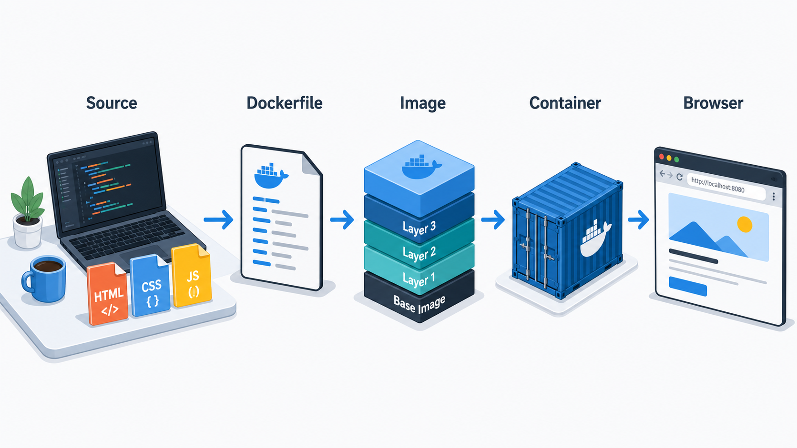
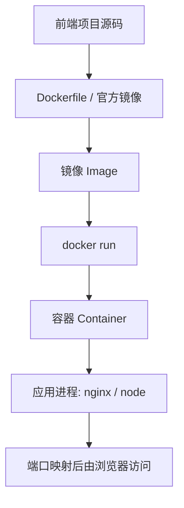

# 第 1 阶段：容器基础与 Docker 入门



这一阶段的目标是先把容器的心智模型建立准确。前端开发者学 Docker，最容易卡住的点通常不是命令本身，而是镜像、容器、端口、文件系统、构建产物这些概念混在一起。这里先把边界讲清楚，再开始跑第一个容器。

## 学习目标

学完这一阶段，你应该能做到：

- 解释 Docker、镜像、容器、仓库之间的关系
- 说清容器和虚拟机的差异，以及容器共享宿主机内核这件事意味着什么
- 在自己的电脑上安装并验证 Docker
- 运行第一个容器，理解 `docker run` 做了哪些动作
- 用前端视角理解“构建环境”和“运行环境”
- 用 Docker 跑一个最小静态前端产物，完成从 `vite build` 到 `nginx` 提供访问的闭环

## 先建立正确心智模型

### Docker 解决的核心问题

Docker 用来统一软件的运行环境。对前端团队来说，它最直接的价值有三类：

- 统一 Node 版本、包管理器、系统依赖，减少“我这里可以跑，你那里不行”
- 用固定镜像运行本地依赖服务，比如 `nginx`、`redis`、`mysql`
- 把前端构建产物和运行环境一起封装，方便交付测试环境、预发环境和生产环境

### 前端类比：把抽象概念翻成你熟悉的对象

- 镜像 `image`：像一份可复用的构建模板，接近“打包后的环境快照”
- 容器 `container`：像根据模板启动出来的一个运行实例，接近“当前运行中的进程环境”
- 仓库 `registry`：像 npm registry，用来存放和分发镜像
- Dockerfile：像一份可执行的环境构建脚本，地位接近“部署环境专用的构建说明书”

这个类比有帮助，但边界要清楚：

- Docker 镜像比 `package.json` 完整得多，因为它不仅描述依赖，还包含基础操作系统层、运行时、文件内容和启动命令
- 容器比浏览器标签页更接近“隔离出来的进程组”，它有自己的文件系统视图、网络命名空间和进程空间

### 容器和虚拟机的区别

Mermaid 流程图先看结构：



再看运行方式差异：

- 虚拟机：每个实例通常都有独立 Guest OS，隔离更重，启动更慢，资源占用更高
- 容器：多个容器共享宿主机内核，启动更快，镜像更轻，更适合应用级交付

这里有一个新手常见误解需要直接纠正：

- 容器提供的是进程级隔离，不是“迷你电脑”
- 容器里运行的是一个或多个进程，核心关注点是应用进程如何启动、通信、持久化和退出
- Docker 默认不帮你解决所有运维问题，日志、监控、备份、扩缩容仍然需要设计

## 核心概念

### 镜像 Image

镜像是只读模板，通常由多层组成。你可以把它理解为“某个运行环境在某个时间点的打包结果”。例如：

- `node:20-alpine`：包含 Node.js 20 运行时和 Alpine Linux 基础环境
- `nginx:alpine`：包含 Nginx 服务器和 Alpine Linux 基础环境

镜像本身不在运行。只有你基于镜像启动实例后，才会得到容器。

### 容器 Container

容器是镜像的运行实例。你每执行一次 `docker run nginx:alpine`，Docker 都会基于镜像创建一个新的可运行实例。

关键点：

- 同一个镜像可以启动多个容器
- 容器有自己的生命周期：创建、启动、停止、删除
- 容器默认是临时可替换的，删除后容器内部改动通常也会消失，持久化数据要靠卷挂载，后面阶段会展开

### 仓库 Registry

镜像需要一个分发位置，仓库就是这个角色。常见仓库：

- Docker Hub
- GitHub Container Registry
- 阿里云、腾讯云、Harbor 等私有仓库

这和 npm registry 的思路一致：都提供拉取、发布、版本标签管理。

### Docker Engine 和 Docker Desktop

- Docker Engine：真正负责构建镜像、启动容器的后台服务
- Docker Desktop：桌面端集成工具，内置图形界面、CLI、虚拟化支持和一些开发辅助能力

Windows 和 macOS 上，日常学习一般直接安装 Docker Desktop。Linux 上更常见的是直接安装 Docker Engine。

## 安装与验证

### Windows

推荐路线：

1. 安装 WSL2
2. 安装 Docker Desktop
3. 在 Docker Desktop 里确认 WSL integration 已开启

新手容易被一句“Docker 运行在 Windows 上”带偏。更准确的表述是：

- Windows 上的 Linux 容器通常运行在 WSL2 提供的 Linux 环境里
- 你在 PowerShell、Windows Terminal 或 WSL 终端里执行 `docker` 命令，本质上是在调用 Docker 提供的 CLI

### macOS

直接安装 Docker Desktop，安装后用终端执行 Docker CLI 即可。

### Linux

安装 Docker Engine 和 Docker Compose Plugin，确认当前用户具备运行 Docker 的权限。

### 验证安装

按顺序执行下面几条命令：

```bash
docker --version                 # 查看 Docker CLI 版本，确认命令已安装
docker compose version           # 查看 Compose 插件版本，确认多容器编排能力可用
docker info                      # 查看 Docker 引擎信息，确认后台服务正在运行
```

理解这三条命令很重要：

- `docker --version` 成功，只能说明 CLI 存在
- `docker info` 成功，才说明 Docker 后台服务能正常响应
- `docker compose version` 成功，才说明你当前环境支持新版 Compose 子命令

### 常见安装报错

#### `Cannot connect to the Docker daemon`

含义：CLI 找到了，后台服务没连通。常见原因：

- Docker Desktop 没启动
- WSL2 集成没开
- Linux 上 Docker 服务没启动

#### `docker: command not found`

含义：CLI 没装好，或者环境变量还没生效。

## 第一条命令：`hello-world`

这一条命令非常适合用来理解 `docker run` 的完整动作链。

```bash
docker run hello-world           # 拉取 hello-world 镜像并启动一个测试容器，验证 Docker 能正常拉取和运行镜像
```

如果本地没有这个镜像，Docker 会自动做几件事：

1. 去默认仓库查找 `hello-world`
2. 把镜像拉到本地
3. 基于镜像创建容器
4. 启动容器里的程序
5. 输出提示信息
6. 程序结束后，容器进入已退出状态

这个例子有两个关键认知：

- `docker run` 不是“只负责启动”，它通常还包含“拉取镜像、创建容器、启动进程”
- 容器退出不代表失败。只要容器内主进程执行完毕，容器结束就是正常行为

### 查看运行结果

```bash
docker ps                        # 查看当前正在运行的容器
docker ps -a                     # 查看所有容器，包括已退出的容器
docker images                    # 查看本地已有的镜像
```

你会发现：

- `hello-world` 往往不会出现在 `docker ps` 里，因为它执行完就退出了
- 它会出现在 `docker ps -a` 里，因为容器对象仍然存在

这也是很多新手第一次接触时容易误判的地方：容器“退出”和容器“报错”是两个不同状态，需要结合日志看。

### 删除测试容器

```bash
docker rm <container_id>         # 删除一个已经停止的容器，保持本地环境整洁
```

如果你不知道 `container_id`，先看：

```bash
docker ps -a                     # 先找到容器 ID 或容器名称，再删除目标容器
```

## 常用命令最小集合

第 1 阶段只需要先掌握下面这些：

```bash
docker pull nginx:alpine         # 拉取指定版本的 nginx 镜像到本地
docker images                    # 查看本地镜像列表
docker run -d --name web nginx:alpine   # 后台启动一个名为 web 的 nginx 容器
docker ps                        # 查看正在运行的容器
docker logs web                  # 查看容器日志，确认服务是否正常启动
docker stop web                  # 停止正在运行的容器
docker rm web                    # 删除已经停止的容器
```

参数先记住最有用的几个：

- `-d`：后台运行
- `--name`：给容器起一个容易识别的名字

## 前端视角理解“构建环境”和“运行环境”

前端项目天然分成两个阶段：

- 构建阶段：安装依赖、执行 `vite build`
- 运行阶段：把 `dist` 目录交给静态服务器提供访问

这两件事经常发生在不同环境里。对 Docker 来说，这意味着：

- 你可以用 `node` 镜像做构建
- 你可以用 `nginx` 镜像做静态资源服务

这个拆分非常重要，因为它直接影响镜像体积、启动速度和安全性。

### 一个容易误导新手的说法

“前端项目运行在 Node 容器里”这句话只在开发场景成立，而且指的是开发服务器。

更准确的表述是：

- 开发阶段：Vite dev server 常运行在 Node 环境里
- 生产阶段：前端静态产物通常运行在 Nginx、CDN 或对象存储后面

## Vite 静态构建入门：从源码到静态服务

这一节先不追求复杂 Dockerfile，只跑通一条最小链路。假设你本地已经有一个 Vite 项目，并且项目根目录下存在 `dist` 目录。

如果你还没构建过，先在本地项目里执行：

```bash
npm install                      # 安装项目依赖，生成 node_modules
npm run build                    # 执行 Vite 生产构建，生成 dist 静态产物
```

这一步的产物通常是：

- `index.html`
- 打包后的 JS/CSS 资源
- 图片、字体等静态资源

### 用 Nginx 容器直接托管本地 `dist`

下面这个例子非常适合前端新手理解“挂载构建产物 + 端口映射”。

先进入你的 Vite 项目根目录，再执行：

```bash
docker run -d --name vite-static-demo -p 8080:80 -v ${PWD}/dist:/usr/share/nginx/html nginx:alpine   # 启动 nginx 容器，把本地 dist 目录挂载到 nginx 默认静态目录，并把本机 8080 映射到容器 80
```

Windows PowerShell 下，`${PWD}` 通常可用；如果环境不兼容，也可以改写成绝对路径，例如：

```bash
docker run -d --name vite-static-demo -p 8080:80 -v C:/project/demo/dist:/usr/share/nginx/html nginx:alpine   # 用绝对路径挂载 dist 目录，避免终端变量展开差异带来的路径问题
```

然后访问：

```text
http://localhost:8080
```

这条命令背后发生了三件事：

1. Docker 启动 `nginx:alpine` 容器
2. 本地 `dist` 目录映射到容器内的 Nginx 静态文件目录
3. 浏览器访问宿主机 `8080`，请求被转发到容器 `80`

### 验证容器是否正常工作

```bash
docker ps                                 # 查看 vite-static-demo 容器是否处于运行状态
docker logs vite-static-demo              # 查看 nginx 启动日志，确认容器内主进程正常
docker exec -it vite-static-demo sh       # 进入容器 shell，检查静态文件是否已经挂载进去
```

进入容器后可以执行：

```bash
ls /usr/share/nginx/html                  # 查看容器内 nginx 静态目录，确认 dist 文件已生效
```

### 清理演示容器

```bash
docker stop vite-static-demo              # 停止演示容器
docker rm vite-static-demo                # 删除演示容器
```

## 端口、进程、访问路径这三个概念要分开

前端新手第一次接触容器，经常把下面几件事混为一谈：

- 应用进程监听的端口
- 容器暴露的端口
- 宿主机映射出去的端口
- 浏览器实际访问的 URL

这里先建立基础认知：

- Nginx 在容器内监听 `80`
- `-p 8080:80` 表示宿主机 `8080` 转发到容器 `80`
- 浏览器访问的是宿主机地址 `http://localhost:8080`

这也是为什么你不能只看容器里监听哪个端口，还要看是否做了端口映射。

## 常见误区

### 误区 1：容器就是虚拟机

正确理解：容器更接近被隔离出来的应用进程运行环境。

影响：

- 容器生命周期通常更短
- 容器内文件修改默认不具备长期持久化能力
- 容器内进程退出，容器通常也会退出

### 误区 2：拉了镜像就等于服务在运行

正确理解：`docker pull` 只把镜像下载到本地，服务是否运行取决于你是否创建并启动了容器。

```bash
docker pull nginx:alpine         # 只下载镜像，不会自动启动 nginx 服务
docker run -d nginx:alpine       # 基于镜像创建并启动容器，服务才开始运行
```

### 误区 3：容器能直接访问宿主机所有文件

正确理解：容器默认只能看到镜像内文件和它自己的可写层。宿主机目录要通过挂载显式映射进去。

### 误区 4：前端项目上 Docker 后就天然适合生产

正确理解：生产可用还需要关注镜像体积、缓存策略、静态资源 gzip/brotli、反向代理、健康检查、日志和发布流程。

### 误区 5：`EXPOSE` 就等于已经对外开放端口

正确理解：`EXPOSE` 主要是镜像元数据说明，真正让宿主机可访问，依然要靠 `-p` 端口映射。

## 给前端开发者的实践建议

- 本阶段先用官方镜像，减少无关变量
- 先把“镜像”和“容器”的区别彻底记住，再学 Dockerfile
- 先跑静态构建产物，再跑 Vite 开发服务器，认知路径更稳
- 学会用 `docker ps`、`docker logs`、`docker exec` 观察容器状态，这比背命令更关键

## 练习任务

### 练习 1：验证安装

完成以下命令并解释输出含义：

```bash
docker --version                 # 查看 Docker CLI 版本
docker compose version           # 查看 Compose 插件版本
docker info                      # 查看 Docker 引擎状态与基础信息
```

要求你能说清：

- 哪条命令证明 CLI 已安装
- 哪条命令证明 Docker 后台正在运行

### 练习 2：运行第一个容器

执行并观察：

```bash
docker run hello-world           # 运行官方测试镜像，验证镜像拉取、容器创建和程序执行链路
docker ps                        # 查看当前运行中的容器
docker ps -a                     # 查看所有容器，确认 hello-world 已退出但记录还在
```

要求你能说清：

- 为什么 `hello-world` 不在 `docker ps` 里
- 为什么它仍然能在 `docker ps -a` 里看到

### 练习 3：托管一个 Vite 构建产物

准备一个 Vite 项目，执行：

```bash
npm run build                    # 生成生产构建产物 dist
docker run -d --name vite-static-demo -p 8080:80 -v ${PWD}/dist:/usr/share/nginx/html nginx:alpine   # 用 nginx 容器托管 dist 目录
docker logs vite-static-demo     # 查看容器日志，确认 nginx 正常启动
```

要求你能说清：

- 为什么这里用的是 `nginx` 而不是 `node`
- 浏览器访问地址为什么是 `http://localhost:8080`

### 练习 4：清理现场

```bash
docker stop vite-static-demo     # 停止演示容器
docker rm vite-static-demo       # 删除演示容器
```

要求你养成习惯：实验结束后清理无用容器，保持环境可控。

## 这一阶段你应该真正记住的几句话

- 镜像是模板，容器是运行实例
- `docker pull` 下载镜像，`docker run` 创建并启动容器
- 容器关注的是应用进程如何运行
- 前端项目通常分为构建阶段和静态资源运行阶段
- Docker 学习的第一步不是背命令，而是建立准确的运行模型
