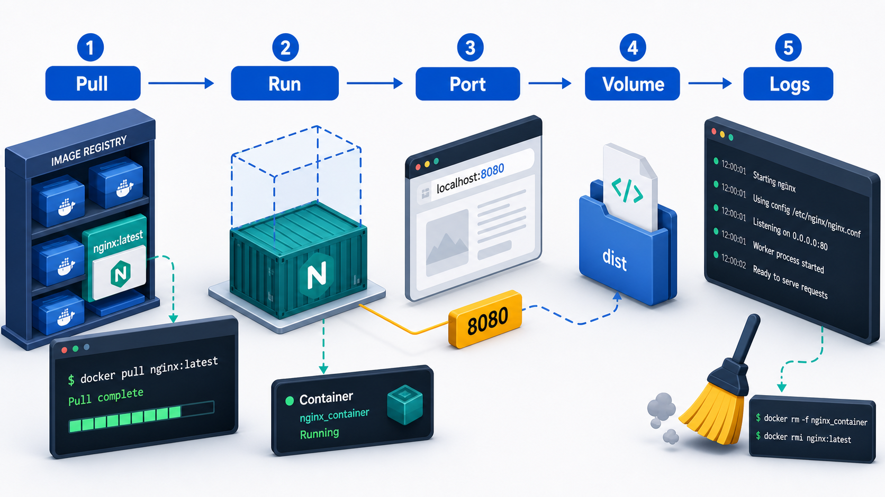
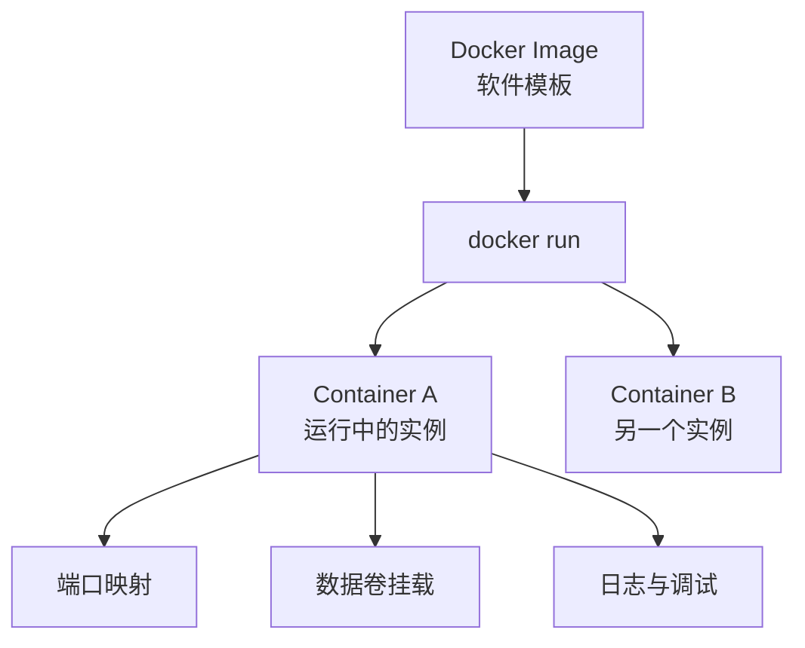
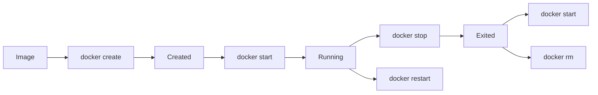

# 第 2 阶段：Docker 镜像与容器操作



这一阶段的目标很明确：你要把镜像、容器、生命周期、端口映射、数据挂载、日志排查、进入容器调试这些核心操作用熟。前端开发里最常见的两类场景是：

- 用 `nginx` 容器托管静态资源
- 用 `node` 容器跑 `Vite` 开发环境

这两个场景的运行模型不同。`nginx` 镜像自带服务进程，容器启动后服务立即可用；`node` 镜像提供的是运行时环境，Vite 需要你在容器里主动启动。

## 2.1 先建立准确模型

### 镜像是什么

镜像可以理解为一个只读的软件模板，里面包含：

- 基础操作系统环境
- 应用运行时
- 应用代码或静态文件
- 启动命令

例如：

- `nginx:alpine`：内置 Nginx 服务
- `node:20-alpine`：内置 Node.js 运行时

### 容器是什么

容器是镜像的运行实例。你执行 `docker run` 后，Docker 会基于镜像创建一个可运行的隔离环境，这个环境就是容器。

一个镜像可以启动多个容器。例如你可以基于同一个 `nginx:alpine` 镜像启动测试容器、演示容器、临时调试容器。

### 镜像和容器的关系



可以记成一句话：镜像负责定义内容，容器负责承载运行。

## 2.2 镜像管理基础

前端工程里常用镜像主要是 `nginx` 和 `node`。先把镜像操作跑一遍。

### 拉取镜像

```bash
docker pull nginx:alpine        # 拉取轻量版 Nginx 镜像，适合静态站点演示和部署入门
docker pull node:20-alpine      # 拉取 Node 20 轻量镜像，适合运行前端构建和开发命令
```

### 查看本地镜像

```bash
docker images                   # 查看本地所有镜像，确认仓库名、标签、镜像 ID、体积
```

### 按名称筛选镜像

```bash
docker images nginx             # 查看本地所有 nginx 相关镜像
docker images node              # 查看本地所有 node 相关镜像
```

### 删除不用的镜像

```bash
docker rmi nginx:alpine         # 删除指定标签的镜像
docker rmi node:20-alpine       # 删除 Node 20 轻量镜像
```

如果某个镜像仍然被容器占用，Docker 会拒绝删除。处理顺序是：先删容器，再删镜像。

### 标签的意义

镜像名通常写成：

```text
仓库名:标签
```

例如：

- `nginx:alpine`
- `node:20-alpine`
- `node:20`

`alpine` 表示基于 Alpine Linux，镜像更小；`20` 表示 Node 的主版本。教程和生产配置里都应该尽量写明确标签，避免直接使用 `latest` 造成环境漂移。

## 2.3 容器生命周期

容器是有生命周期的，前端开发最常用的动作包括创建、启动、停止、重启、删除、查看状态、进入容器。

### 生命周期流程图



### 一条命令直接创建并启动

```bash
docker run -d --name web-demo nginx:alpine   # 基于 nginx 镜像创建并后台启动一个名为 web-demo 的容器
```

这条命令做了三件事：

- 如果本地没有镜像，先拉取镜像
- 创建容器
- 启动容器

### 查看运行中的容器

```bash
docker ps                                    # 只查看当前正在运行的容器
docker ps -a                                 # 查看所有容器，包括已经停止的容器
```

### 停止与启动容器

```bash
docker stop web-demo                         # 停止名为 web-demo 的容器
docker start web-demo                        # 启动一个已经存在但当前停止的容器
docker restart web-demo                      # 重启容器，适合服务修改后快速重启
```

### 删除容器

```bash
docker rm web-demo                           # 删除已停止的容器
docker rm -f web-demo                        # 强制删除容器，运行中的容器也会先被停止再删除
```

### 查看容器详情

```bash
docker inspect web-demo                      # 查看容器完整元数据，包括 IP、挂载、端口映射、启动命令
```

### 容器命名建议

容器名建议体现用途，常见写法：

- `frontend-nginx-demo`
- `vite-dev`
- `project-admin-web`

这种命名方式在你同时跑多个容器时更容易排查问题。

## 2.4 场景一：Nginx 静态服务容器

这一节讲的是“容器启动即服务可用”的场景。

### 运行一个最小 Nginx 容器

```bash
docker run -d --name nginx-demo -p 8080:80 nginx:alpine   # 启动 Nginx 容器，并把宿主机 8080 映射到容器 80
```

参数说明：

- `-d`：后台运行
- `--name nginx-demo`：给容器起名字
- `-p 8080:80`：宿主机访问 `8080`，实际转发到容器内的 `80`

访问地址：

```text
http://localhost:8080
```

### 端口映射为什么生效

Nginx 在容器内已经默认监听 `80` 端口。Docker 把宿主机 `8080` 转发给容器 `80` 后，浏览器就能访问容器内的服务。


### 用挂载替换默认首页

假设你本地有一个静态页面目录，例如：

```text
./demo-site
```

里面有一个 `index.html`，现在把它挂进 Nginx：

```bash
docker run -d --name nginx-static -p 8081:80 -v ${PWD}/demo-site:/usr/share/nginx/html nginx:alpine   # 把本地静态目录挂载到 Nginx 默认站点目录
```

Windows PowerShell 中如果 `${PWD}` 兼容性不好，可以直接写绝对路径：

```bash
docker run -d --name nginx-static -p 8081:80 -v C:/project/demo-site:/usr/share/nginx/html nginx:alpine   # 显式指定本地目录，避免路径解析问题
```

访问地址：

```text
http://localhost:8081
```

这一类容器适合：

- 演示打包后的前端页面
- 本地验证静态资源部署结构
- 模拟生产里由 Nginx 提供静态文件的方式

## 2.5 场景二：Vite 开发容器

这一节讲的是“容器只提供运行环境，服务需要你手动启动”的场景。

`node:20-alpine` 镜像里没有 Vite 服务，也没有你的项目代码。你需要把本地项目挂进容器，再在容器内执行 `npm install` 和 `npm run dev`。

### 启动一个前端开发容器

```bash
docker run -it --rm --name vite-dev -p 5173:5173 -v ${PWD}:/app -w /app node:20-alpine sh   # 启动交互式 Node 容器，挂载当前项目目录，并把工作目录设置为 /app
```

参数说明：

- `-it`：进入交互式终端，方便你在容器里执行命令
- `--rm`：容器退出后自动删除，适合临时开发容器
- `-p 5173:5173`：把容器内 Vite 端口映射到宿主机
- `-v ${PWD}:/app`：挂载当前前端项目目录
- `-w /app`：进入容器后默认工作目录是 `/app`
- `sh`：启动一个 shell，等待你输入命令

### 在容器内安装依赖并启动 Vite

进入容器后执行：

```bash
npm install                                # 安装当前前端项目依赖
npm run dev -- --host 0.0.0.0              # 启动 Vite，并监听所有网卡，宿主机浏览器才能访问容器内服务
```

访问地址：

```text
http://localhost:5173
```

### 为什么必须加 `--host 0.0.0.0`

很多前端同学第一次把 Vite 放进容器时，容器日志显示服务启动成功，但浏览器打不开。根因通常是 Vite 默认只监听容器内部的 `127.0.0.1`。这样容器外部拿不到这个端口。

`--host 0.0.0.0` 会让 Vite 在容器的所有网卡上监听，Docker 才能把映射出来的端口转发给宿主机。

### 用一条命令直接跑 Vite

当你已经熟悉这个过程后，可以把安装和启动合成一条命令：

```bash
docker run -it --rm --name vite-dev -p 5173:5173 -v ${PWD}:/app -w /app node:20-alpine sh -c "npm install && npm run dev -- --host 0.0.0.0"   # 启动 Node 容器后先安装依赖，再启动 Vite 开发服务器
```

这条命令适合快速验证。日常开发更推荐用 `Dockerfile` 或 `docker compose` 固化配置，后面阶段会继续展开。

## 2.6 `exec`：进入正在运行的容器

你会经常需要进入容器看文件、看环境变量、检查端口、手动执行命令。

### 进入运行中的 Nginx 容器

```bash
docker exec -it nginx-demo sh              # 进入 nginx-demo 容器的 shell 环境
```

### 在运行中的容器里执行单条命令

```bash
docker exec nginx-demo ls /usr/share/nginx/html   # 查看 Nginx 默认站点目录下有哪些文件
docker exec nginx-demo nginx -t                   # 检查 Nginx 配置是否正确
```

### 进入运行中的 Vite 容器

如果你的 Vite 容器是长期运行的，也可以这样进入：

```bash
docker exec -it vite-dev sh               # 进入 vite-dev 容器，检查 node_modules、源码和进程状态
```

`exec` 是排障的核心命令。只看 `docker ps` 很难定位问题，进入容器后你才能确认服务到底有没有启动、文件有没有挂进去、依赖有没有装成功。

## 2.7 日志：先看日志，再改代码

日志是容器排查的第一入口。

### 查看容器日志

```bash
docker logs nginx-demo                     # 查看 nginx-demo 容器的完整日志
docker logs vite-dev                       # 查看 vite-dev 容器的完整日志
```

### 持续跟踪日志

```bash
docker logs -f nginx-demo                  # 持续输出 Nginx 容器日志，适合观察访问和错误信息
docker logs -f vite-dev                    # 持续输出 Vite 容器日志，适合确认依赖安装和开发服务启动过程
```

### 只看最后几行

```bash
docker logs --tail 50 vite-dev             # 只查看最后 50 行日志，减少信息噪音
```

日志里你最应该关注的内容：

- 端口监听是否成功
- 配置文件是否报错
- 挂载目录是否为空
- `npm install` 是否失败
- Vite 是否提示访问地址和监听地址

## 2.8 数据挂载：Bind Mount 和 Volume

前端学习 Docker 时，最容易混淆的是“本地目录挂载”和“Docker volume”。

### Bind Mount

Bind mount 是把宿主机某个真实目录直接挂进容器。

```bash
docker run -d --name nginx-static -p 8081:80 -v C:/project/demo-site:/usr/share/nginx/html nginx:alpine   # 把宿主机目录直接挂到容器的 Nginx 站点目录
```

特点：

- 本地改文件，容器里立刻能看到
- 适合前端源码开发和静态文件调试
- 非常依赖宿主机路径正确

### Volume

Volume 是由 Docker 管理的持久化存储空间。

```bash
docker volume create nginx-cache           # 创建一个 Docker volume，用于持久化数据
docker run -d --name nginx-with-volume -p 8082:80 -v nginx-cache:/usr/share/nginx/html nginx:alpine   # 把 volume 挂到容器目录
```

特点：

- 数据由 Docker 管理
- 宿主机路径细节对你透明
- 适合数据库、缓存目录、构建缓存

### 查看 volume

```bash
docker volume ls                           # 查看所有 volume
docker volume inspect nginx-cache          # 查看 volume 的详细信息和真实存储位置
```

### 前端场景怎么选

- 挂载源码目录、静态页面目录：优先用 bind mount
- 持久化构建缓存、包缓存：可以用 volume
- 数据库、Redis、PostgreSQL 这类状态数据：优先用 volume

## 2.9 端口映射的准确理解

端口映射语法：

```bash
-p 宿主机端口:容器端口
```

例如：

```bash
docker run -d --name nginx-demo -p 8080:80 nginx:alpine   # 宿主机访问 8080，转发到容器内的 80
docker run -it --rm --name vite-dev -p 5173:5173 -v ${PWD}:/app -w /app node:20-alpine sh   # 宿主机访问 5173，转发到容器内的 5173
```

注意这个逻辑：

- 容器内服务监听哪个端口，右边就写哪个端口
- 你希望浏览器访问宿主机哪个端口，左边就写哪个端口

### 常见误区

错误理解：

- 只写了 `-p 5173:5173`，但容器里没有启动 Vite
- Vite 已经启动，但监听的是 `127.0.0.1`
- 访问 `localhost:8080`，实际容器内服务监听的是 `3000`

正确排查顺序：

1. 用 `docker ps` 看容器是否还在运行
2. 用 `docker logs` 看服务是否启动成功
3. 用 `docker exec` 进入容器，确认进程和文件是否存在
4. 对照 `-p` 参数确认宿主机端口和容器端口是否匹配

## 2.10 前端工程里的高频命令清单

### 容器管理

```bash
docker ps                                  # 查看运行中的容器
docker ps -a                               # 查看全部容器
docker stop nginx-demo                     # 停止容器
docker start nginx-demo                    # 启动已存在容器
docker restart nginx-demo                  # 重启容器
docker rm nginx-demo                       # 删除已停止容器
docker rm -f nginx-demo                    # 强制删除容器
```

### 镜像管理

```bash
docker images                              # 查看本地镜像
docker pull nginx:alpine                   # 拉取 Nginx 镜像
docker pull node:20-alpine                 # 拉取 Node 镜像
docker rmi nginx:alpine                    # 删除指定镜像
```

### 调试与排查

```bash
docker logs -f vite-dev                    # 持续查看 Vite 容器日志
docker exec -it vite-dev sh                # 进入 Vite 容器调试
docker inspect vite-dev                    # 查看容器的端口、挂载、环境变量等详细信息
docker volume ls                           # 查看 Docker volume
```

## 2.11 常见坑

### 1. 拉起了 Node 容器，却以为前端服务已经启动

`node:20-alpine` 只提供 Node 运行环境。你需要自己执行 `npm install` 和 `npm run dev`，或者在镜像里预先定义启动命令。

### 2. Vite 容器能启动，浏览器打不开

优先检查三件事：

- 是否做了 `-p 5173:5173`
- 是否执行了 `npm run dev -- --host 0.0.0.0`
- 容器日志里是否真的显示 Vite 启动成功

### 3. 静态目录挂载成功，但页面还是默认 Nginx 欢迎页

优先检查：

- 本地目录里是否真的有 `index.html`
- 挂载路径是否是 `/usr/share/nginx/html`
- 容器是否挂到了错误目录

### 4. 删除了容器，数据也没了

容器内文件系统默认是临时的。你需要：

- 静态文件开发场景用 bind mount
- 需要持久化的数据用 volume

### 5. Windows 路径写法不兼容

前端同学在 Windows 上最常见的问题是卷挂载路径格式不稳定。最稳妥的方式是先用绝对路径，确认挂载成功后再抽象到脚本或 Compose 文件。

### 6. 把开发容器和生产容器写成一个心智模型

前端开发里要一直区分这两类容器：

- `nginx` 容器：适合提供打包后的静态资源
- `node + vite` 容器：适合本地开发和调试

## 2.12 实操作业

### 作业 1：跑通一个 Nginx 静态页面

目标：

- 本地新建一个 `demo-site/index.html`
- 用 `nginx:alpine` 容器挂载这个目录
- 浏览器通过 `http://localhost:8081` 打开页面

建议命令：

```bash
docker run -d --name nginx-static-homework -p 8081:80 -v C:/project/demo-site:/usr/share/nginx/html nginx:alpine   # 启动 Nginx 并挂载本地静态页面目录
```

验收标准：

- `docker ps` 能看到容器运行中
- 浏览器能打开你自己的页面
- `docker logs nginx-static-homework` 没有明显报错

### 作业 2：用容器跑一个 Vite 项目

目标：

- 把现有 React 或 Vue 项目挂进 `node:20-alpine`
- 在容器内安装依赖
- 用容器启动 Vite

建议命令：

```bash
docker run -it --rm --name vite-homework -p 5173:5173 -v ${PWD}:/app -w /app node:20-alpine sh   # 挂载当前前端项目并进入容器
npm install                                                                                         # 在容器内安装依赖
npm run dev -- --host 0.0.0.0                                                                       # 在容器内启动 Vite 开发服务器
```

验收标准：

- 浏览器能访问 `http://localhost:5173`
- 修改源码后页面能热更新
- 你能解释清楚 `-p 5173:5173` 和 `--host 0.0.0.0` 各自的作用

### 作业 3：练习容器调试

目标：

- 进入一个运行中的容器
- 查看站点目录
- 查看日志
- 停止并删除容器

建议命令：

```bash
docker exec -it nginx-demo sh              # 进入运行中的 nginx 容器
docker logs nginx-demo                     # 查看 nginx 容器日志
docker stop nginx-demo                     # 停止容器
docker rm nginx-demo                       # 删除容器
```

## 2.13 这一阶段你应该掌握什么

完成本阶段后，你应该能稳定回答并操作这些问题：

- 镜像和容器的区别是什么
- `docker run` 到底做了什么
- Nginx 容器为什么启动后就能访问
- Node 容器为什么还需要手动启动 Vite
- `-p 8080:80` 和 `-p 5173:5173` 分别在映射什么
- `bind mount` 和 `volume` 在前端项目里怎么选
- 服务打不开时，应该先看 `docker ps`、`docker logs` 还是 `docker exec`

这一阶段过关的标准很简单：你能独立把静态前端页面跑进 Nginx 容器，也能独立把 Vite 项目跑进 Node 容器，并且知道问题出在哪里、该用什么命令排查。
