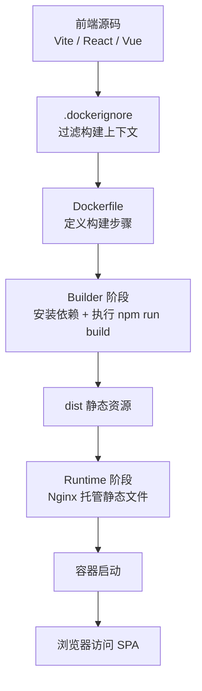
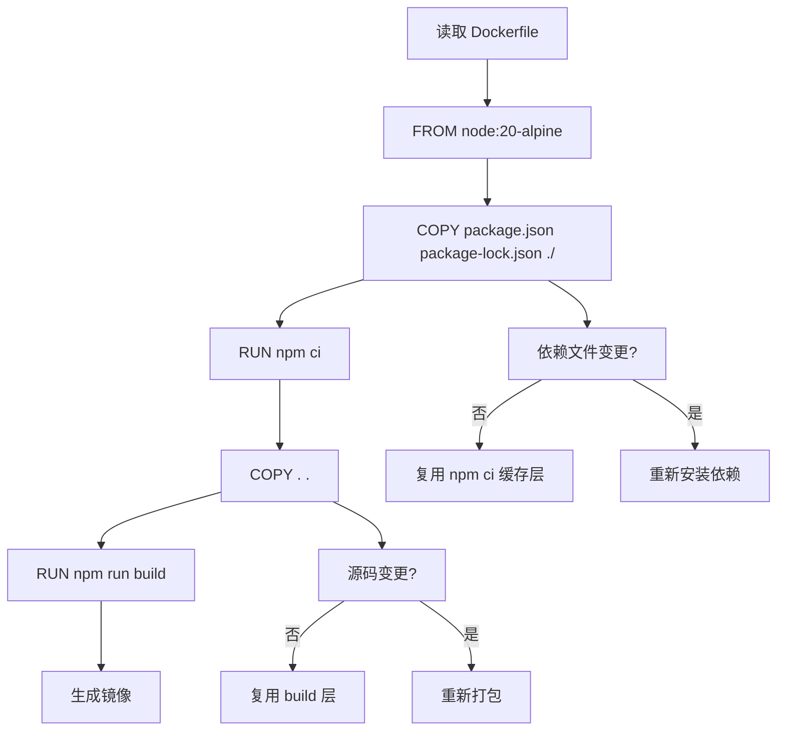
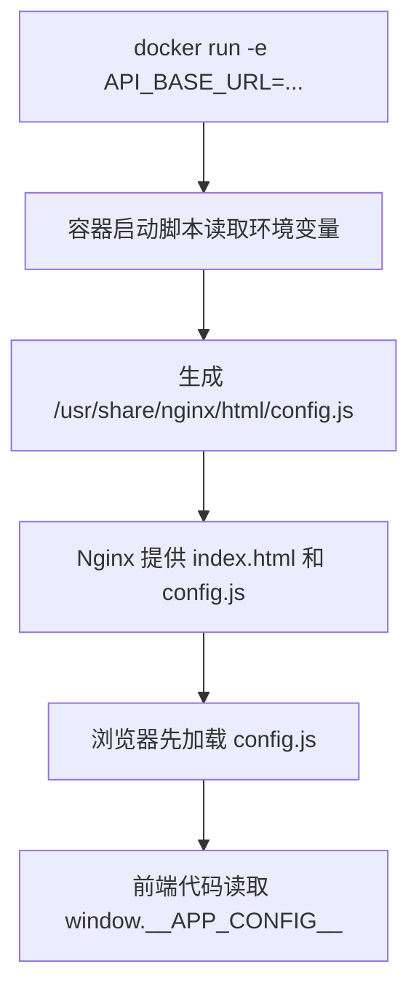

# 第 3 阶段：Dockerfile 与自定义镜像


这一阶段的目标是把前端项目从“能在本机跑起来”，推进到“能稳定构建、可重复交付、可以直接部署”。对 Vite、React、Vue 项目来说，核心工作有三件事：定义构建环境、控制构建输入、产出适合运行的生产镜像。

## 本阶段你会掌握什么

- 读懂并编写前端项目常见的 `Dockerfile`
- 理解 `FROM`、`WORKDIR`、`COPY`、`RUN`、`ARG`、`ENV`、`CMD`、`ENTRYPOINT`、`EXPOSE` 的职责
- 理解镜像层与缓存复用规则，减少无效重建
- 写出适合 Vite 项目的 `.dockerignore`
- 正确使用多阶段构建，把构建环境和运行环境拆开
- 用 Nginx 托管 React Router / Vue Router 的 SPA
- 分清构建期变量和运行期变量，避免把前端配置写错层次

## 先建立正确心智模型

`Dockerfile` 是镜像的构建脚本。它描述的是“镜像怎么做出来”，不是“容器启动后临时手工做什么”。

前端项目在 Docker 里的典型交付链路如下：



这个流程里有两个非常关键的分界：

- 构建阶段：需要 Node、npm、源代码、依赖安装和打包工具
- 运行阶段：只需要静态文件和 Web Server，通常是 Nginx

这就是多阶段构建的基础理由。

## Dockerfile 常用指令

### `FROM`

指定基础镜像，也是每个构建阶段的起点。

```dockerfile
FROM node:20-alpine
```

含义：

- 使用 `node:20-alpine` 作为基础环境
- 这个镜像里已经包含 Node.js 和 npm
- `alpine` 版本体积更小，适合前端构建场景

### `WORKDIR`

设置后续指令执行的工作目录。

```dockerfile
WORKDIR /app
```

含义：

- 后续 `COPY`、`RUN`、`CMD` 默认都在 `/app` 这个目录上下文执行
- 这比在每条命令里手写完整路径更稳定

### `COPY`

把构建上下文里的文件复制进镜像。

```dockerfile
COPY package.json package-lock.json ./
COPY . .
```

含义：

- 第一条只复制依赖描述文件，便于缓存依赖安装层
- 第二条再复制全部源码
- 顺序设计直接影响构建速度

### `RUN`

在镜像构建阶段执行命令，通常用于安装依赖、打包、生成文件。

```dockerfile
RUN npm ci
RUN npm run build
```

含义：

- `npm ci` 按锁文件安装依赖，适合 CI 和镜像构建
- `npm run build` 生成 `dist` 产物

### `ARG`

定义构建参数，只在镜像构建期间可用。

```dockerfile
ARG VITE_API_BASE_URL
```

含义：

- 构建时通过 `--build-arg` 传值
- 构建完成后，`ARG` 不会自动成为容器运行环境变量

### `ENV`

定义环境变量，构建阶段可读，容器运行时也会保留。

```dockerfile
ENV NODE_ENV=production
```

含义：

- 后续构建步骤能读取到这个变量
- 容器启动后进程也能读取到这个变量

### `EXPOSE`

声明容器预期使用的端口。

```dockerfile
EXPOSE 80
```

含义：

- 这是文档化声明，方便阅读和协作
- 真正对外开放端口仍然需要 `docker run -p`

### `CMD`

定义容器默认启动命令。

```dockerfile
CMD ["nginx", "-g", "daemon off;"]
```

含义：

- 容器启动后默认执行 Nginx
- `daemon off;` 让 Nginx 前台运行，保持容器主进程存活

### `ENTRYPOINT`

定义固定入口命令，适合封装固定启动逻辑。

对纯静态前端镜像，`CMD` 已经够用。只有你需要固定启动脚本时，才建议引入 `ENTRYPOINT`。

## 一个最小可用的前端生产镜像

下面先看一个适合 Vite React / Vue 项目的生产版 Dockerfile。

```dockerfile
# 第一阶段：使用 Node 构建前端静态资源
FROM node:20-alpine AS builder

# 设置工作目录，后续命令都在 /app 下执行
WORKDIR /app

# 先复制依赖清单，便于缓存 npm ci 这一层
COPY package.json package-lock.json ./

# 按锁文件安装依赖，保证构建环境可重复
RUN npm ci

# 再复制全部源码，源码变化只会影响后续层
COPY . .

# 执行生产构建，生成 dist 目录
RUN npm run build

# 第二阶段：使用 Nginx 托管打包后的静态资源
FROM nginx:1.27-alpine AS runtime

# 删除 Nginx 默认站点文件，避免旧页面干扰
RUN rm -rf /usr/share/nginx/html/*

# 把构建产物复制到 Nginx 静态目录
COPY --from=builder /app/dist /usr/share/nginx/html

# 声明容器内服务端口
EXPOSE 80

# 前台启动 Nginx，保持容器持续运行
CMD ["nginx", "-g", "daemon off;"]
```

构建和运行命令：

```bash
docker build -t vite-spa:1.0.0 .                  # 根据当前目录的 Dockerfile 构建镜像，并打上 vite-spa:1.0.0 标签
docker run -d --name vite-spa -p 8080:80 vite-spa:1.0.0  # 后台启动容器，把宿主机 8080 映射到容器 80
docker ps                                         # 查看容器是否正常启动
docker logs vite-spa                              # 查看容器日志，确认 Nginx 是否正常工作
```

访问地址：

```text
http://localhost:8080
```

## 为什么推荐 `npm ci`

前端项目镜像构建建议优先使用 `npm ci`，理由很明确：

- 它严格依赖 `package-lock.json`
- 它安装结果更可预测
- 它适合 CI 和自动化构建
- 它会清理已有 `node_modules`，减少构建环境漂移

只有在项目没有锁文件时，才使用 `npm install`。成熟项目应该提交锁文件。

## 镜像缓存怎么工作

Docker 会按顺序执行 Dockerfile，每条会生成一个镜像层。某一层的输入没变化时，Docker 可以直接复用缓存。

### 缓存命中流程



### 影响缓存命中的关键点

1. `COPY package.json package-lock.json ./` 放在前面  
依赖文件不变时，`npm ci` 可以复用缓存。

2. `COPY . .` 放在依赖安装后面  
源码修改只会影响打包层，不会触发重新安装全部依赖。

3. 构建参数变化会使相关层失效  
如果 `ARG` 参与了 `RUN npm run build`，那这层及后续层会重建。

### 错误示范

```dockerfile
FROM node:20-alpine
WORKDIR /app
COPY . .
RUN npm install
RUN npm run build
```

这个写法的问题：

- 源码任何一个文件变化，都会导致依赖层重新执行
- 如果上下文里混入本地 `node_modules`，构建结果更不稳定
- `npm install` 的可重复性弱于 `npm ci`

## `.dockerignore` 必须认真写

`.dockerignore` 决定哪些文件不会进入构建上下文。它直接影响：

- 构建速度
- 镜像缓存命中率
- 上下文体积
- 敏感文件泄露风险

### 适合 Vite / React / Vue 项目的 `.dockerignore`

```dockerignore
# 本地依赖目录，容器构建时会重新安装
node_modules

# 构建产物目录，生产镜像会重新生成
dist

# Git 元数据，不参与镜像构建
.git
.gitignore

# 编辑器和系统文件
.DS_Store
.vscode
.idea

# 本地日志和临时文件
*.log
tmp
temp

# 本地环境文件，避免把敏感配置直接带进镜像
.env.local
.env.development.local
.env.test.local

# Docker 自己的输出文件
Dockerfile.dev
docker-compose.override.yml
```

### `.dockerignore` 的常见误区

1. 漏掉 `node_modules`  
本机依赖会被复制进上下文，体积暴涨，而且不同系统编译的二进制模块可能不兼容。

2. 漏掉 `.git`  
会把大量历史对象一起送进构建上下文，显著拖慢构建。

3. 误排除 `package-lock.json`  
这会破坏 `npm ci` 的前提。

4. 误以为 `.dockerignore` 能阻止 `COPY` 某个已进入上下文的文件  
它的作用发生在“发送上下文之前”，不是构建后的文件删除器。

## 多阶段构建是前端生产镜像的标准写法

多阶段构建的核心价值是把“构建工具链”和“运行时”隔离开。

### 单阶段的问题

如果你直接使用 Node 镜像运行生产站点，通常会带来这些问题：

- 镜像体积更大
- 运行时带着 npm、源码和构建工具
- 攻击面更大
- 启动职责混杂

### 多阶段版本

```dockerfile
# syntax=docker/dockerfile:1

# builder 阶段：负责安装依赖和打包
FROM node:20-alpine AS builder
WORKDIR /app
COPY package.json package-lock.json ./
RUN npm ci
COPY . .
RUN npm run build

# runtime 阶段：只负责提供静态资源服务
FROM nginx:1.27-alpine AS runtime
COPY --from=builder /app/dist /usr/share/nginx/html
EXPOSE 80
CMD ["nginx", "-g", "daemon off;"]
```

构建命令：

```bash
docker build -t frontend-prod:latest .           # 构建生产镜像，最终只保留 runtime 阶段的内容
docker image ls frontend-prod                    # 查看镜像是否生成成功
```

### 只构建某个阶段调试

```bash
docker build --target builder -t frontend-builder-debug .  # 只构建到 builder 阶段，便于检查依赖安装和打包过程
docker run --rm -it frontend-builder-debug sh              # 进入 builder 镜像，手动查看 dist、node_modules 等目录
```

这个调试技巧很实用，能快速定位构建失败是在安装依赖阶段还是打包阶段。

## 构建期变量和运行期变量的边界

这一段必须讲清楚，因为这里最容易误导前端初学者。

### 构建期变量

构建期变量参与的是 `docker build` 过程，适合控制：

- 前端打包时的 API 基地址
- 构建环境标记
- 某些可公开的特性开关

示例：

```dockerfile
FROM node:20-alpine AS builder
WORKDIR /app
COPY package.json package-lock.json ./
RUN npm ci
COPY . .

# 定义构建参数，用于打包阶段注入 Vite 变量
ARG VITE_API_BASE_URL

# 把构建参数传给当前 RUN 以及后续指令
ENV VITE_API_BASE_URL=$VITE_API_BASE_URL

# 执行打包，前端代码会在编译时读取 import.meta.env.VITE_API_BASE_URL
RUN npm run build
```

构建命令：

```bash
docker build -t frontend-api-a . --build-arg VITE_API_BASE_URL=https://api.example.com  # 构建镜像时注入前端打包变量
```

Vite 代码读取方式：

```ts
const apiBaseUrl = import.meta.env.VITE_API_BASE_URL;
```

这里的关键事实：

- `import.meta.env.VITE_API_BASE_URL` 在打包时就会被写进产物
- 浏览器最终拿到的是静态文件里的值
- 镜像启动后再改容器环境变量，已经不会影响这份已打包的前端代码

### 运行期变量

运行期变量发生在 `docker run` 或容器启动时，适合服务端进程读取：

- Node SSR 服务
- BFF 服务
- Nginx 启动脚本动态生成配置

示例：

```bash
docker run -d --name frontend-prod -p 8080:80 -e APP_ENV=production frontend-prod:latest  # 启动容器时注入运行期环境变量
```

这条命令里的 `APP_ENV=production`：

- 容器进程可以读到
- Nginx 启动脚本可以读到
- 已经打包完成的 SPA 静态代码默认读不到

### 对前端项目最容易出错的点

很多人会这样理解：

- 在 `docker run -e VITE_API_BASE_URL=...` 里传值
- 浏览器中的 Vite 前端会自动拿到这个值

这个理解不成立。对纯静态 SPA，构建完成后，前端代码已经固定。运行容器时再传入环境变量，浏览器侧源码不会重新编译。

### 正确方案有两类

1. 构建期注入  
适合环境固定的部署方式，比如测试环境镜像、生产环境镜像分别构建。

2. 启动时生成配置文件  
容器启动时用脚本把环境变量写到 `/usr/share/nginx/html/config.js`，前端运行时再去读取这个文件。

## 前端运行期配置的可落地方案

对需要“一份镜像部署多个环境”的 SPA，推荐使用启动时生成配置文件。

### 思路流程



### 示例目录

```text
frontend/
├─ dist/
├─ docker/
│  ├─ nginx.conf
│  └─ entrypoint.sh
└─ Dockerfile
```

### `entrypoint.sh`

```sh
#!/bin/sh
set -eu

cat >/usr/share/nginx/html/config.js <<EOF
window.__APP_CONFIG__ = {
  API_BASE_URL: "${API_BASE_URL:-http://localhost:3000}"
};
EOF

exec nginx -g 'daemon off;'
```

### 配套 Dockerfile

```dockerfile
FROM node:20-alpine AS builder
WORKDIR /app
COPY package.json package-lock.json ./
RUN npm ci
COPY . .
RUN npm run build

FROM nginx:1.27-alpine AS runtime
COPY --from=builder /app/dist /usr/share/nginx/html
COPY docker/nginx.conf /etc/nginx/conf.d/default.conf
COPY docker/entrypoint.sh /entrypoint.sh
RUN chmod +x /entrypoint.sh
EXPOSE 80
CMD ["/entrypoint.sh"]
```

### 启动命令

```bash
docker build -t frontend-runtime-config:latest .                      # 构建支持运行期注入配置的生产镜像
docker run -d --name frontend-runtime-config -p 8080:80 -e API_BASE_URL=https://api.prod.example.com frontend-runtime-config:latest  # 启动容器并写入运行期配置
```

### 前端读取方式

```ts
declare global {
  interface Window {
    __APP_CONFIG__?: {
      API_BASE_URL?: string;
    };
  }
}

export const runtimeApiBaseUrl =
  window.__APP_CONFIG__?.API_BASE_URL ?? "http://localhost:3000";
```

这个方案适合前后端分离的静态站点，也是线上部署里更稳妥的做法。

## Nginx 托管 SPA 必须处理路由回退

React Router 和 Vue Router 的 history 模式都依赖前端路由。浏览器直接访问 `/users/1` 时，服务端需要把请求回退到 `index.html`。

如果你不加这个配置，容器里静态文件虽然存在，刷新子路由还是会得到 `404`。

### `nginx.conf`

```nginx
server {
  listen 80;
  server_name localhost;

  root /usr/share/nginx/html;
  index index.html;

  location / {
    try_files $uri $uri/ /index.html;
  }

  location /assets/ {
    expires 7d;
    add_header Cache-Control "public, max-age=604800";
  }
}
```

### 带 SPA 配置的 Dockerfile

```dockerfile
FROM node:20-alpine AS builder
WORKDIR /app
COPY package.json package-lock.json ./
RUN npm ci
COPY . .
RUN npm run build

FROM nginx:1.27-alpine AS runtime
RUN rm -rf /usr/share/nginx/html/*
COPY --from=builder /app/dist /usr/share/nginx/html
COPY docker/nginx.conf /etc/nginx/conf.d/default.conf
EXPOSE 80
CMD ["nginx", "-g", "daemon off;"]
```

启动命令：

```bash
docker build -t vite-spa-nginx:latest .              # 构建包含自定义 Nginx 配置的 SPA 镜像
docker run -d --name vite-spa-nginx -p 8080:80 vite-spa-nginx:latest  # 启动容器并映射到本机 8080
```

验证方式：

```bash
docker exec -it vite-spa-nginx sh                    # 进入容器检查 Nginx 配置和静态文件
ls /usr/share/nginx/html                             # 查看 dist 是否已被正确复制
cat /etc/nginx/conf.d/default.conf                   # 查看是否已经启用 SPA 路由回退配置
```

## Vite / React / Vue 项目的推荐目录与文件

```text
my-frontend-app/
├─ src/
├─ public/
├─ package.json
├─ package-lock.json
├─ vite.config.ts
├─ Dockerfile
├─ .dockerignore
└─ docker/
   └─ nginx.conf
```

这个结构适合三类场景：

- 本地前端开发
- CI 构建镜像
- Nginx 容器部署 SPA

## 一个更完整的生产示例

### Dockerfile

```dockerfile
# syntax=docker/dockerfile:1

FROM node:20-alpine AS deps
WORKDIR /app

# 先复制依赖描述文件，确保 npm ci 缓存层稳定
COPY package.json package-lock.json ./
RUN npm ci

FROM node:20-alpine AS builder
WORKDIR /app

# 复用 deps 阶段已安装好的依赖
COPY --from=deps /app/node_modules /app/node_modules
COPY . .

# 构建期变量，用于前端打包
ARG VITE_API_BASE_URL
ENV VITE_API_BASE_URL=$VITE_API_BASE_URL

# 产出 dist 静态文件
RUN npm run build

FROM nginx:1.27-alpine AS runtime
RUN rm -rf /usr/share/nginx/html/*
COPY docker/nginx.conf /etc/nginx/conf.d/default.conf
COPY --from=builder /app/dist /usr/share/nginx/html
EXPOSE 80
CMD ["nginx", "-g", "daemon off;"]
```

### 构建命令

```bash
docker build -t frontend-release:2026-06 --build-arg VITE_API_BASE_URL=https://api.example.com .  # 构建前端发布镜像，并传入打包阶段的 API 地址
docker image inspect frontend-release:2026-06      # 查看镜像元数据，确认标签和构建结果
```

### 运行命令

```bash
docker run -d --name frontend-release -p 8080:80 frontend-release:2026-06  # 启动生产镜像，使用 Nginx 提供静态资源
docker logs frontend-release                         # 查看容器日志，确认 Nginx 启动成功
```

## 开发镜像和生产镜像要分开看

前端项目在 Docker 里通常会有两类镜像：

1. 开发镜像  
用于 `npm run dev`、热更新、挂载源码、调试依赖问题。

2. 生产镜像  
用于 `npm run build` 后的静态资源托管，强调稳定、轻量、可部署。

它们的 Dockerfile 可以分开维护，也可以用一个文件通过不同 `target` 阶段区分。教学阶段建议你先把生产镜像写对，再扩展开发镜像。

## 练习 1：给 Vite React 项目写生产镜像

目标：把一个 Vite React 项目构建成 Nginx 可运行镜像。

步骤：

1. 创建项目

```bash
npm create vite@latest my-react-app -- --template react   # 创建一个基于 React 模板的 Vite 项目
cd my-react-app                                            # 进入项目目录
npm install                                                # 安装项目依赖
```

2. 添加 `.dockerignore`

```dockerignore
node_modules
dist
.git
*.log
.env.local
```

3. 添加 `docker/nginx.conf`

```nginx
server {
  listen 80;
  server_name localhost;

  root /usr/share/nginx/html;
  index index.html;

  location / {
    try_files $uri $uri/ /index.html;
  }
}
```

4. 添加 `Dockerfile`

```dockerfile
FROM node:20-alpine AS builder
WORKDIR /app
COPY package.json package-lock.json ./
RUN npm ci
COPY . .
RUN npm run build

FROM nginx:1.27-alpine AS runtime
COPY docker/nginx.conf /etc/nginx/conf.d/default.conf
COPY --from=builder /app/dist /usr/share/nginx/html
EXPOSE 80
CMD ["nginx", "-g", "daemon off;"]
```

5. 构建并运行

```bash
docker build -t my-react-app:stage3 .               # 构建 React 生产镜像
docker run -d --name my-react-app -p 8080:80 my-react-app:stage3  # 启动镜像并把服务暴露到本机 8080
```

6. 验证

- 打开 `http://localhost:8080`
- 手动访问任意前端路由，例如 `/about`
- 刷新页面，确认没有 `404`

## 练习 2：给 Vite Vue 项目注入构建期变量

目标：把 API 地址写入前端构建产物。

步骤：

1. 创建项目

```bash
npm create vite@latest my-vue-app -- --template vue   # 创建一个基于 Vue 模板的 Vite 项目
cd my-vue-app                                          # 进入项目目录
npm install                                            # 安装项目依赖
```

2. 在代码中读取变量

```ts
const apiBaseUrl = import.meta.env.VITE_API_BASE_URL;
console.log(apiBaseUrl);
```

3. 在 Dockerfile 中注入构建参数

```dockerfile
FROM node:20-alpine AS builder
WORKDIR /app
COPY package.json package-lock.json ./
RUN npm ci
COPY . .
ARG VITE_API_BASE_URL
ENV VITE_API_BASE_URL=$VITE_API_BASE_URL
RUN npm run build

FROM nginx:1.27-alpine
COPY --from=builder /app/dist /usr/share/nginx/html
EXPOSE 80
CMD ["nginx", "-g", "daemon off;"]
```

4. 执行构建

```bash
docker build -t my-vue-app:api --build-arg VITE_API_BASE_URL=https://api.dev.example.com .  # 构建时传入前端 API 地址
```

5. 验证结果

```bash
docker run --rm -p 8080:80 my-vue-app:api             # 临时启动容器用于验证页面输出
```

然后在浏览器开发者工具里查看打包后的请求地址是否正确。

## 练习 3：实现运行期配置注入

目标：做到同一份镜像可在不同环境使用不同 API 地址。

步骤：

1. 构建前端产物
2. 增加 `entrypoint.sh` 生成 `config.js`
3. 前端应用启动时读取 `window.__APP_CONFIG__`
4. 通过 `docker run -e API_BASE_URL=...` 验证不同环境值

建议你至少做一次这个练习。它会直接提升你对“构建期配置”和“运行期配置”的边界判断能力。

## 常见错误与修正

### 错误 1：把本地 `node_modules` 复制进镜像

现象：

- 镜像体积异常大
- 容器里安装报错
- `esbuild`、`sharp`、`node-sass` 这类依赖可能出现平台不兼容

修正：

- 在 `.dockerignore` 里排除 `node_modules`
- 让容器自己执行 `npm ci`

### 错误 2：源码一改就重新安装全部依赖

现象：

- 构建很慢
- 每次都卡在 `npm install` 或 `npm ci`

修正：

- 先 `COPY package.json package-lock.json ./`
- 再 `RUN npm ci`
- 最后 `COPY . .`

### 错误 3：以为 `docker run -e VITE_API_BASE_URL=...` 能改 SPA 配置

现象：

- 浏览器里看到的 API 地址仍然是旧值

修正：

- 使用 `--build-arg` 做构建期注入
- 或者改成 `config.js` 的运行期注入方案

### 错误 4：Nginx 里没有配置路由回退

现象：

- 首页能打开
- 刷新 `/users`、`/settings` 这类路径时返回 `404`

修正：

- 在 `location /` 中加入 `try_files $uri $uri/ /index.html;`

### 错误 5：开发镜像和生产镜像混在一起

现象：

- 镜像里保留了源代码、构建工具、npm 缓存
- 镜像偏大，职责模糊

修正：

- 开发环境使用 Node 镜像
- 生产环境使用多阶段构建，最终运行阶段使用 Nginx

### 错误 6：`EXPOSE 80` 后以为宿主机能直接访问

现象：

- 容器启动了，浏览器访问不到

修正：

- 使用端口映射命令

```bash
docker run -d -p 8080:80 my-react-app:stage3         # 把宿主机 8080 映射到容器 80，浏览器才能访问
```

## 排错命令速查

```bash
docker build -t stage3-debug .                       # 构建当前项目镜像，观察构建日志
docker run --rm -it stage3-debug sh                  # 进入镜像交互调试文件内容
docker image ls                                      # 查看本机镜像列表
docker history stage3-debug                          # 查看镜像层历史，判断哪些层可能过大
docker exec -it my-react-app sh                      # 进入运行中的容器排查 Nginx 配置和静态资源
docker logs my-react-app                             # 查看容器标准输出日志
docker inspect my-react-app                          # 查看容器挂载、环境变量、网络、端口映射等元数据
```

## 这一阶段的交付标准

你完成这一阶段后，应该能独立做到：

- 给 React 或 Vue 的 Vite 项目写出生产可用的多阶段 Dockerfile
- 用 `.dockerignore` 控制构建上下文
- 用缓存友好的顺序组织 `COPY` 和 `RUN`
- 理解 `ARG`、`ENV`、运行期环境变量三者的职责边界
- 用 Nginx 正确托管 SPA，并处理前端路由刷新
- 能用日志、构建阶段调试、容器检查定位常见错误

建议你把这一阶段至少练熟两次：一次做 React 项目，一次做 Vue 项目。真正掌握之后，你写前端镜像会非常稳定，后面进入 Compose、多容器联调和 CI/CD 也会顺很多。
