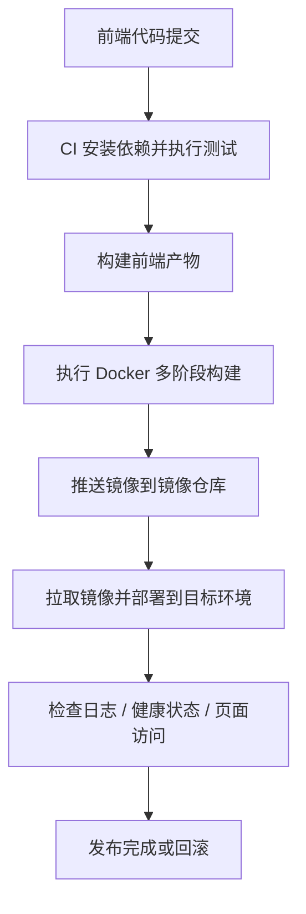
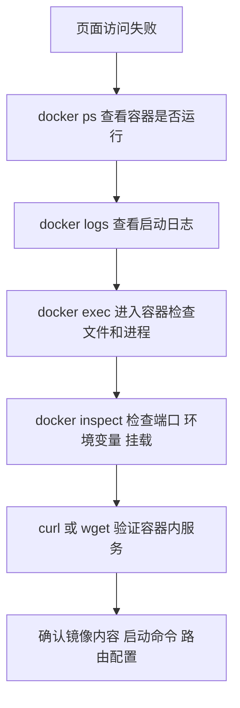

# 第 6 阶段：Docker 实战与最佳实践


这一阶段解决两个核心问题：

1. 前端项目怎样构建出更小、更安全、更稳定的生产镜像。
2. 项目上线后怎样发布、观测、排错、回滚。

本阶段默认你已经掌握基础的 `Dockerfile`、端口映射、卷挂载、Compose 和网络知识。这里全部从生产视角讲，重点放在前端静态站点和 Node SSR / 自定义服务两类镜像。

## 学习目标

- 理解前端静态镜像和 Node SSR 镜像的职责差异
- 掌握多阶段构建、基础镜像选择、缓存优化、减小镜像体积的方法
- 学会使用非 root 用户运行容器
- 理解环境变量、构建参数、secret 的适用边界
- 掌握日志查看、容器排错、镜像检查的常见手段
- 能读懂并维护一个基础的 GitHub Actions Docker 发布流程
- 建立上线前检查清单，减少误发布和低级故障

## 先建立正确模型

前端项目进生产环境，常见有两条路线：

1. 静态前端：React、Vue、Vite 项目构建后得到 `dist/`，最终由 `nginx` 或 CDN 提供静态文件。
2. Node SSR / 自定义服务：Next.js SSR、Nuxt SSR、Express 中间层、BFF、Node 渲染服务，需要容器里持续运行 Node 进程。

这两类镜像的最佳实践不同：

- 静态镜像关注体积、缓存策略、静态资源交付
- Node 服务镜像关注运行时依赖、进程稳定性、权限、健康检查、日志

## 生产发布流程



## 一、镜像优化：先把镜像职责做对

### 1. 静态前端镜像

适用于 Vite、React SPA、Vue SPA、管理后台、官网静态站点。

推荐策略：

- 构建阶段使用 Node 镜像
- 运行阶段使用 `nginx:alpine`
- 只把构建产物复制到运行镜像
- 不把源码、`node_modules`、测试文件带进最终镜像

示例：Vite 静态站点生产镜像

```dockerfile
# 第一阶段：使用 Node 构建前端产物
FROM node:20-alpine AS builder

# 设置工作目录，后续命令都在 /app 下执行
WORKDIR /app

# 先复制依赖清单，便于复用 Docker 构建缓存
COPY package.json package-lock.json ./

# 安装生产构建所需依赖
RUN npm ci

# 复制项目源码
COPY . .

# 执行前端构建，生成 dist 目录
RUN npm run build

# 第二阶段：使用 Nginx 提供静态资源服务
FROM nginx:1.27-alpine

# 删除默认静态文件，避免旧页面干扰
RUN rm -rf /usr/share/nginx/html/*

# 复制前端构建产物到 Nginx 默认站点目录
COPY --from=builder /app/dist /usr/share/nginx/html

# 复制自定义 Nginx 配置，用于 SPA 路由和缓存控制
COPY nginx.conf /etc/nginx/conf.d/default.conf

# 暴露容器内 80 端口
EXPOSE 80

# 以前台模式启动 Nginx，让容器保持运行
CMD ["nginx", "-g", "daemon off;"]
```

这个镜像有几个关键点：

- `builder` 阶段负责安装依赖和构建
- 最终镜像只保留 `nginx` 和 `dist`
- 最终镜像体积通常显著小于直接把 Node 运行环境带进生产

### 2. Node SSR / 自定义服务镜像

适用于 Next.js SSR、Nuxt SSR、Express、Koa、Nest、BFF 服务。

推荐策略：

- 构建阶段和运行阶段分离
- 运行阶段只安装运行时依赖
- 容器进程使用非 root 用户
- 明确 `PORT`、`NODE_ENV`、健康检查和日志输出位置

示例：Node SSR / 自定义服务生产镜像

```dockerfile
# 第一阶段：安装完整依赖并构建应用
FROM node:20-alpine AS builder

# 设置工作目录
WORKDIR /app

# 复制依赖清单
COPY package.json package-lock.json ./

# 安装完整依赖，包含构建期依赖
RUN npm ci

# 复制项目源码
COPY . .

# 构建 SSR 或服务端代码
RUN npm run build

# 第二阶段：创建运行时镜像
FROM node:20-alpine AS runner

# 声明生产环境
ENV NODE_ENV=production

# 设置工作目录
WORKDIR /app

# 仅复制依赖清单
COPY package.json package-lock.json ./

# 只安装生产依赖，减小镜像体积
RUN npm ci --omit=dev

# 复制构建产物
COPY --from=builder /app/dist ./dist

# 如果项目有 public、views、next.config 等运行时需要的文件，也要一起复制
# COPY --from=builder /app/public ./public

# 创建普通用户，避免使用 root 直接运行服务
RUN addgroup -S appgroup && adduser -S appuser -G appgroup

# 切换到普通用户
USER appuser

# 暴露应用端口
EXPOSE 3000

# 启动 Node 服务
CMD ["node", "dist/server.js"]
```

这类镜像和静态镜像的区别很明确：

- 静态镜像最终由 Nginx 提供文件
- SSR 镜像最终由 Node 进程提供 HTTP 服务
- SSR 镜像更需要关注内存、权限、启动命令、健康状态

## 二、镜像体积优化与构建速度优化

### 1. 使用 `.dockerignore`

很多新手镜像很大，根因是把整个项目上下文都传进 Docker 构建过程。前端项目里经常误传这些内容：

- `node_modules`
- `dist`
- `.git`
- `.vscode`
- 测试截图
- 本地缓存
- `.env.local`

推荐 `.dockerignore`：

```gitignore
node_modules
dist
.git
.DS_Store
.vscode
coverage
*.log
.env.local
.env.*.local
```

### 2. 利用缓存层

错误写法会导致每次代码变更都重新安装依赖：

```dockerfile
COPY . .
RUN npm ci
```

更好的写法：

```dockerfile
COPY package.json package-lock.json ./
RUN npm ci
COPY . .
RUN npm run build
```

原因很简单：

- 依赖文件不变时，`npm ci` 这一层可以复用缓存
- 日常改动页面代码时，构建速度明显更快

### 3. 选择合适基础镜像

常见选择建议：

- `node:20-alpine`：体积小，适合多数前端项目
- `node:20-bookworm-slim`：兼容性更稳，适合依赖原生模块的项目
- `nginx:alpine`：静态前端非常常用

选择原则：

- 追求小体积，优先 `alpine`
- 遇到原生依赖编译、二进制兼容问题，优先 `slim`
- 生产环境镜像版本保持固定，不直接写 `latest`

### 4. 固定镜像版本

建议写法：

```dockerfile
FROM node:20.19-alpine
FROM nginx:1.27-alpine
```

这样做的价值：

- 构建结果更可预测
- 团队成员和 CI 环境更一致
- 排查问题时更容易复现

## 三、非 root 运行：生产容器的基础要求

很多基础教程默认容器里直接用 root 跑服务，这在生产里风险过高。正确做法是显式创建普通用户。

示例：

```dockerfile
# 创建系统组 appgroup
RUN addgroup -S appgroup

# 创建系统用户 appuser，并加入 appgroup
RUN adduser -S appuser -G appgroup

# 把当前容器进程切换为普通用户
USER appuser
```

如果你的服务需要写日志或写上传目录，还要处理目录权限：

```dockerfile
# 创建运行时目录并授权给普通用户
RUN mkdir -p /app/runtime && chown -R appuser:appgroup /app/runtime
```

为什么要这样做：

- 降低容器内进程权限
- 降低漏洞利用后的破坏面
- 更符合生产安全基线

## 四、环境变量、构建参数、Secret

这是前端 Docker 场景里最容易被讲错的一块。

### 1. `ARG` 适合构建阶段参数

```dockerfile
# 定义构建参数 API_BASE_URL
ARG API_BASE_URL

# 把构建参数注入为环境变量，供前端构建脚本读取
ENV VITE_API_BASE_URL=$API_BASE_URL
```

构建命令：

```bash
docker build -t my-frontend:prod --build-arg API_BASE_URL=https://api.example.com .  # 构建镜像，并把 API 地址传给前端构建过程
```

适用场景：

- Vite / React / Vue 在构建时替换接口地址
- 构建时注入版本号、提交号、环境标记

注意边界：

- 前端静态资源构建后的变量会被打进产物
- 浏览器端可见的数据都不属于 secret

### 2. `ENV` 适合运行时环境变量

```dockerfile
# 声明 Node 服务运行时环境
ENV NODE_ENV=production

# 声明服务监听端口
ENV PORT=3000
```

运行命令：

```bash
docker run -d --name web -p 3000:3000 -e PORT=3000 my-ssr-app:1.0.0  # 启动容器，并在运行时传入环境变量
```

适用场景：

- Node SSR 服务端口
- 日志级别
- Node 后端调用其他内网服务的地址

### 3. Secret 不要写进镜像

这些内容不要直接写进 Dockerfile：

- 数据库密码
- 第三方服务 Token
- 私钥
- 云厂商访问密钥

高质量做法：

- 本地开发使用 `.env` 文件和 `.gitignore`
- CI 使用 GitHub Actions Secrets
- 生产部署使用平台的 Secret 管理能力

错误示例：

```dockerfile
ENV ACCESS_TOKEN=abcd1234
```

这会把敏感信息直接写进镜像历史层，后续很难清理。

## 五、日志与排错：先看进程，再看配置，再看网络

### 1. 常用排错流程



### 2. 常用命令与中文解释

```bash
docker ps  # 查看当前正在运行的容器，确认服务是否已经启动

docker ps -a  # 查看所有容器，包含已经退出的容器，适合排查容器启动后秒退的问题

docker logs web  # 查看名为 web 的容器日志，先判断应用是否报错

docker logs -f web  # 持续跟踪容器日志，适合观察启动过程和实时请求日志

docker inspect web  # 查看容器详细配置，重点检查端口映射、环境变量、挂载目录

docker exec -it web sh  # 进入运行中的容器，检查文件、进程、配置和网络连通性

docker stats  # 查看容器 CPU 和内存占用，适合排查资源不足或内存飙升
```

### 3. 前端静态镜像常见问题

#### 页面打开 404

常见原因：

- `dist` 没复制进去
- Nginx 配置没处理 SPA 路由回退
- 镜像里仍然是默认欢迎页

检查命令：

```bash
docker exec -it nginx-web sh  # 进入 Nginx 容器检查静态文件

ls /usr/share/nginx/html  # 查看构建产物是否真的在 Nginx 站点目录里

cat /etc/nginx/conf.d/default.conf  # 检查是否配置了前端路由回退规则
```

SPA 常用 Nginx 配置示例：

```nginx
server {
  listen 80;
  server_name localhost;

  root /usr/share/nginx/html;
  index index.html;

  location / {
    try_files $uri $uri/ /index.html;
  }
}
```

#### 构建成功，页面接口地址仍然错误

常见原因：

- 把前端构建时变量和 Node 运行时变量混用了
- 修改了容器运行时环境变量，但静态产物早已在构建阶段固化

技术结论：

- Vite 前端变量主要在 `npm run build` 时注入
- 构建完成后再改容器里的 `ENV`，页面里打包进去的接口地址不会同步变化

### 4. Node SSR 镜像常见问题

#### 容器启动就退出

常见原因：

- `CMD` 路径错误
- 产物目录不存在
- 依赖缺失
- 端口或环境变量读取异常

检查命令：

```bash
docker logs ssr-app  # 查看服务报错堆栈，通常第一时间能定位启动失败原因

docker exec -it ssr-app sh  # 进入容器手动检查 dist、node_modules、配置文件

ls /app/dist  # 确认构建产物目录是否存在

node dist/server.js  # 在容器内手动启动服务，验证启动命令是否正确
```

#### 宿主机访问不到服务

常见原因：

- Node 应用只监听 `127.0.0.1`
- 容器端口和应用监听端口不一致
- `docker run -p` 配置错误

Node 服务需要监听：

```js
app.listen(3000, '0.0.0.0')
```

或者让框架通过环境变量绑定所有网卡。

## 六、构建与发布命令示例

### 1. 构建静态前端镜像

```bash
docker build -t frontend-static:1.0.0 .  # 使用当前目录 Dockerfile 构建静态前端镜像，并打上 1.0.0 标签
```

### 2. 运行静态前端镜像

```bash
docker run -d --name frontend-static -p 8080:80 frontend-static:1.0.0  # 启动静态前端容器，把本机 8080 映射到容器 80
```

### 3. 构建 Node SSR 镜像

```bash
docker build -t frontend-ssr:1.0.0 .  # 构建 Node SSR 镜像，适合 Next SSR 或自定义 Node 服务
```

### 4. 运行 Node SSR 镜像

```bash
docker run -d --name frontend-ssr -p 3000:3000 -e NODE_ENV=production frontend-ssr:1.0.0  # 启动 SSR 容器，并传入生产环境变量
```

### 5. 打标签并推送镜像

```bash
docker tag frontend-static:1.0.0 ghcr.io/your-org/frontend-static:1.0.0  # 给本地镜像打上远程仓库标签

docker push ghcr.io/your-org/frontend-static:1.0.0  # 把镜像推送到 GitHub Container Registry
```

## 七、GitHub Actions 自动构建与发布

下面给出一个适合前端团队维护的基础版本。这个示例适用于把镜像推送到 GitHub Container Registry。

文件：`.github/workflows/docker-release.yml`

```yaml
name: docker-release

on:
  push:
    branches:
      - main
    tags:
      - "v*"

jobs:
  build-and-push:
    runs-on: ubuntu-latest
    permissions:
      contents: read
      packages: write

    steps:
      - name: Checkout source
        uses: actions/checkout@v4

      - name: Setup Docker Buildx
        uses: docker/setup-buildx-action@v3

      - name: Login to GHCR
        uses: docker/login-action@v3
        with:
          registry: ghcr.io
          username: ${{ github.actor }}
          password: ${{ secrets.GITHUB_TOKEN }}

      - name: Extract metadata
        id: meta
        uses: docker/metadata-action@v5
        with:
          images: ghcr.io/your-org/frontend-app
          tags: |
            type=ref,event=branch
            type=ref,event=tag
            type=sha

      - name: Build and push image
        uses: docker/build-push-action@v6
        with:
          context: .
          push: true
          tags: ${{ steps.meta.outputs.tags }}
          labels: ${{ steps.meta.outputs.labels }}
```

### 关键步骤解释

#### `actions/checkout@v4`

拉取当前仓库代码，后续构建步骤才能访问项目文件。

#### `docker/setup-buildx-action@v3`

启用 Buildx，便于使用更强的构建能力和缓存能力。团队后面扩展多平台构建时也会用到。

#### `docker/login-action@v3`

登录镜像仓库。这里使用 `GITHUB_TOKEN` 推送到 GHCR。

#### `docker/metadata-action@v5`

自动生成镜像标签，比如：

- `main`
- `v1.2.0`
- `sha-xxxxxxx`

这样做的价值是镜像标签更规范，回滚更方便。

#### `docker/build-push-action@v6`

完成实际构建和推送。`context: .` 表示使用仓库根目录作为构建上下文，`push: true` 表示构建完成后直接上传。

### 带测试步骤的前端 CI 示例

如果你希望在镜像构建前先验证前端质量，建议加上依赖安装、单元测试和构建检查：

```yaml
name: docker-release

on:
  push:
    branches:
      - main

jobs:
  verify-and-push:
    runs-on: ubuntu-latest
    permissions:
      contents: read
      packages: write

    steps:
      - name: Checkout source
        uses: actions/checkout@v4

      - name: Setup Node
        uses: actions/setup-node@v4
        with:
          node-version: 20
          cache: npm

      - name: Install dependencies
        run: npm ci

      - name: Run unit tests
        run: npm test -- --runInBand

      - name: Build frontend
        run: npm run build

      - name: Setup Docker Buildx
        uses: docker/setup-buildx-action@v3

      - name: Login to GHCR
        uses: docker/login-action@v3
        with:
          registry: ghcr.io
          username: ${{ github.actor }}
          password: ${{ secrets.GITHUB_TOKEN }}

      - name: Build and push image
        uses: docker/build-push-action@v6
        with:
          context: .
          push: true
          tags: ghcr.io/your-org/frontend-app:${{ github.sha }}
```

这个版本更适合团队生产流程，因为它先保证：

- 依赖可安装
- 测试能通过
- 构建成功
- 再发布镜像

## 八、发布检查清单

上线前至少逐项确认这些内容：

- `Dockerfile` 使用固定版本基础镜像
- 已配置 `.dockerignore`
- 多阶段构建已启用
- 最终镜像里没有源码、测试文件、`.env.local`
- 容器以非 root 用户运行
- 运行命令和暴露端口一致
- 静态镜像已校验 `dist` 是否正确复制
- SSR 镜像已校验 `dist/server.js` 或实际入口文件存在
- 环境变量来源明确，secret 没写进镜像
- CI 构建、测试、推送链路可执行
- 发布后有日志检查、健康检查和回滚预案

## 九、常见错误清单

### 1. 用一个 Dockerfile 同时混写静态前端和 SSR 逻辑

结果通常是：

- 镜像职责混乱
- 启动命令不清楚
- 生产环境难维护

处理建议：

- 静态站点走 `Node build + Nginx runtime`
- SSR 服务走 `Node build + Node runtime`

### 2. 把前端接口地址当成运行时 secret

前端构建产物运行在浏览器，接口地址天然可见。你需要区分：

- 浏览器可见配置
- 服务端私密配置

### 3. 容器里仍然使用 root 运行

短期能跑，长期会带来安全和权限边界问题。

### 4. 直接使用 `latest`

发布过程可重复性差，排错困难。

### 5. 日志写到容器内部文件但没有采集

Docker 场景下，优先把日志输出到标准输出和标准错误，便于 `docker logs` 和平台采集。

## 十、练习

### 练习 1：重写静态前端镜像

要求：

- 使用多阶段构建
- 运行阶段使用 `nginx:alpine`
- 添加 `.dockerignore`
- 构建后确认最终镜像里没有 `node_modules`

验收命令：

```bash
docker build -t vite-static-prod:practice .  # 构建练习镜像，验证 Dockerfile 是否可用

docker run -d --name vite-static-prod -p 8080:80 vite-static-prod:practice  # 启动容器，检查页面能否访问

docker exec -it vite-static-prod sh  # 进入容器检查最终镜像内容
```

### 练习 2：重写 SSR 镜像

要求：

- 运行阶段只安装生产依赖
- 使用非 root 用户
- 通过环境变量配置端口

验收命令：

```bash
docker build -t ssr-prod:practice .  # 构建 SSR 练习镜像

docker run -d --name ssr-prod -p 3000:3000 -e PORT=3000 ssr-prod:practice  # 运行 SSR 容器并暴露端口

docker logs ssr-prod  # 查看启动日志，确认服务已正常监听端口
```

### 练习 3：补全 GitHub Actions 发布流程

要求：

- 提交到 `main` 自动构建
- 先跑测试再推送镜像
- 标签包含 `sha`

验收标准：

- Workflow 能在 GitHub Actions 成功执行
- GHCR 中能看到构建出的镜像标签

## 十一、本阶段结论

生产实践里最重要的不是命令数量，而是职责边界和稳定性设计。

- 静态前端镜像以交付静态资源为核心
- SSR / Node 服务镜像以稳定运行 Node 进程为核心
- Secret 管理、非 root、日志与 CI/CD 是生产质量基线
- 高质量 Dockerfile 能同时提升构建速度、镜像体积和发布可靠性

下一阶段继续进入安全与 Kubernetes 衔接，你会把单机 Docker 经验连接到更完整的容器平台思维。
